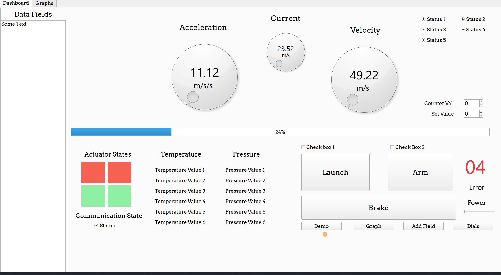
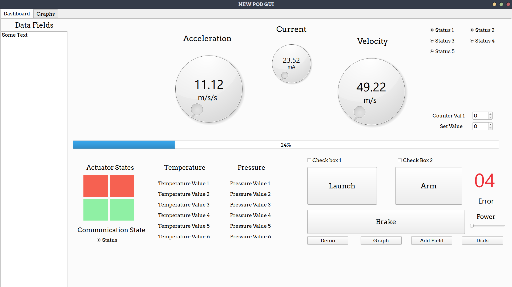
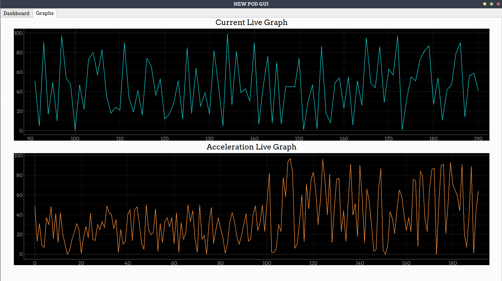

# Vegapod-New-GUI
GUI for the new pod by Vegapod

# Pre-Requisites
1. Windows or Linux x86 64 bit
2. Python Installed on Your system with pip

# Installation
1. In your Virtual python environment, or native one, clone this repo, and in navigate there. Run  
```pip install -r requirements.txt```
2. Run `python Source.py` and that should launch the GUI. 

# Screenshots


# DashBoard


# Graphs



# Credits
Base Code by [Krishnaraj](https://www.github.com/KrishnarajT)